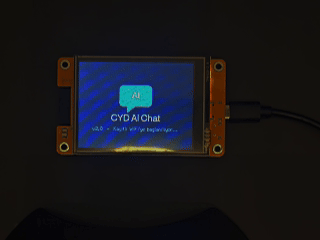

  

# CYD AI Chat

> Turn your Cheap Yellow Display (ESP32-2432S028R) into a powerful AI-powered smart terminal.

CYD AI Chat is an advanced open-source AI client designed specifically for the ESP32 Cheap Yellow Display. It combines modern language models, a touchscreen interface, persistent memory, Wi-Fi management, and intelligent model routing into a compact standalone device.

Unlike simple AI demos, CYD AI Chat aims to deliver a complete user experience on embedded hardware while remaining lightweight, customizable, and easy to deploy.

---

 Key Features

 AI-Powered Conversations

* OpenRouter API integration
* Multiple AI model support
* Automatic model fallback system
* Configurable AI personalities
* Context-aware conversations

 Smart Memory System

* Persistent chat history
* Conversation recovery after reboot
* Local memory storage
* Fast loading and saving

  
 Modern User Interface

* Mobile-inspired chat design
* Touchscreen keyboard
* Message bubbles
* User and AI avatars
* Dark mode interface
* Smooth navigation

 Connectivity

* Built-in Wi-Fi scanner
* Saved network credentials
* Automatic reconnection
* Connection status indicators

   Personalization

* Multiple AI personalities
* Adjustable display brightness
* Customizable settings
* Model selection menu

 Device Integration

* RGB status LEDs
* Real-time clock synchronization
* Touchscreen controls
* Optimized for ESP32 hardware

---

 Upcoming Features

The following features are currently planned for future releases:

* Streaming AI responses
* Markdown rendering
* OTA firmware updates
* Voice input support
* Text-to-Speech (TTS)
* Multi-language interface
* Theme customization
* Plugin system
* QR code generation
* Local AI support
* Custom API providers
* Cloud synchronization
* Conversation export
* Advanced memory management
* AI tools and function calling

---

 Hardware

Supported Device:

* ESP32-2432S028R (Cheap Yellow Display)

---

 Software Stack

* Arduino IDE
* ESP32 Framework
* TFT_eSPI
* XPT2046 Touchscreen
* ArduinoJson
* OpenRouter API

---

 Installation

1. Clone this repository.
2. Open the project in Arduino IDE.
3. Install all required libraries.
4. Add your OpenRouter API key.
5. Select your ESP32 board.
6. Upload the firmware.
7. Connect to Wi-Fi and start chatting.

---

 Why CYD AI Chat?

Most ESP32 AI projects focus only on sending prompts to an API.

CYD AI Chat focuses on building a complete AI device with a polished user experience, persistent memory, intelligent model management, and a modern touchscreen interface.

The goal is simple:

Transform an affordable ESP32 display into a real AI companion.

---

 Open Source

CYD AI Chat is fully open source and welcomes contributions from developers, makers, and AI enthusiasts.

If you find this project useful, consider giving it a star and contributing to its development.

---

 Multi-Language Support

CYD AI Chat now includes a built-in multilingual interface designed for a broader global audience.

Supported Languages:

* 🇹🇷 Turkish
* 🇬🇧 English
* 🇷🇺 Russian

Users can switch between supported languages directly from the settings menu, allowing the interface and user experience to adapt to their preferred language.

This makes CYD AI Chat more accessible for international users while maintaining a lightweight embedded implementation optimized for ESP32 hardware.

---

 License

Released under the MIT License.
